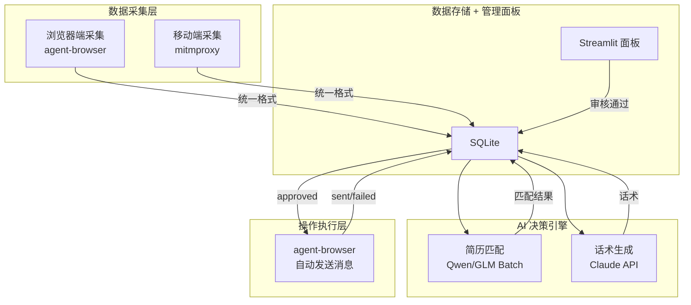
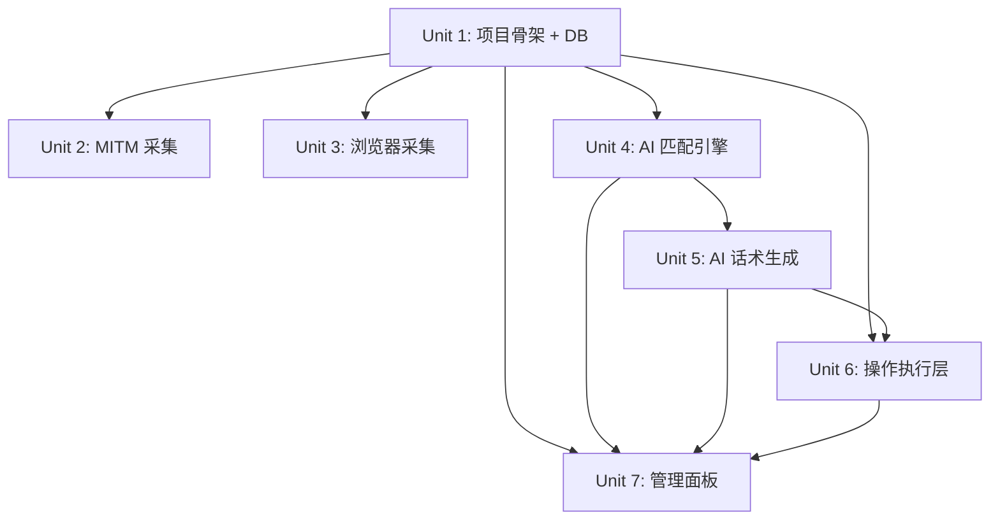

# feat: AI Recruiter Agent MVP

## Overview

构建一个 AI 智能招聘自动化系统的 MVP，覆盖 Boss直聘单平台。系统自动采集候选人数据（浏览器端 + 移动端双通道），AI 进行简历匹配评分和话术生成，顾问通过管理面板审核后自动发送招呼消息。

MVP 范围对应设计文档的 Phase 0-2（技术验证 + 数据采集 + AI 决策 + 操作执行 + 管理面板），约 2-3 周交付。

## Problem Frame

猎头公司（5人以下团队）的顾问在 Boss直聘等招聘平台上，大量时间花在低价值的重复性工作上：搜索简历、筛选匹配度、打招呼、推荐岗位、确认意向。这些工作挤压了高价值活动的时间（高端人选 mapping、客户 BD），导致团队产能受限。

(see origin: ~/.gstack/projects/Recruiter/jiabozhang-unknown-design-20260408-153321.md)

## Requirements Trace

- R1. 双通道数据采集：浏览器端采集（网页端功能完整的平台）+ 移动端采集（网页端阉割或反爬强的平台），采集数据统一格式存入数据库
- R2. AI 简历匹配：输入 JD + 简历，输出 0-100 匹配度评分和匹配理由，支持可配置权重（技术栈 40%、年限 20%、行业 20%、学历 10%、地域 10%）
- R3. AI 话术生成：根据岗位和候选人背景生成个性化招呼话术
- R4. 先审后发：AI 生成话术进入审核队列，顾问批量审核后通过 agent-browser 自动发送
- R5. 候选人去重：同平台 (platform, platform_id) UNIQUE 约束，避免重复打招呼
- R6. 操作安全：频率控制（30-120 秒随机间隔，每小时 30 次上限，每日 150 次上限），circuit-breaker（连续 3 次异常暂停 2 小时）
- R7. 消息状态机：pending → approved → sending → sent/failed/timeout → replied，乐观锁设计
- R8. 管理面板：候选人总览、审核队列、岗位配置、沟通状态查看
- R9. 平台健康检查：启动时验证 Boss直聘关键页面元素存在，改版时告警
- R10. Prompt 版本追踪：match_results 记录 prompt_version，确保分数可比性

## Scope Boundaries

- **只做 Boss直聘单平台**，猎聘/脉脉放到 Phase 4
- **不做内部猎头系统对接**，放到 Phase 4
- **不做多账号管理**，MVP 单账号运行
- **不做意向度自动分析**，放到 Phase 3
- **不做自动跟进逻辑**，放到 Phase 3
- **不做产品化/合规路线**，MVP 为内部自用工具

## Key Technical Decisions

- **操作执行层用 agent-browser（Playwright-based），不用 Computer Use API**：Computer Use 每次操作需 5-20 次截图循环，150 次/天成本 $300-1350/月。agent-browser 免费、毫秒级、确定性脚本。LLM 只用于决策（匹配/话术），不用于操作浏览器。(see origin: eng-review #1)
- **保留 MITM + agent-browser 双通道采集**：用户的行业经验表明网页端功能常被阉割且反爬最强，移动端数据更全、反爬更弱。两个通道按平台特性选择，数据统一格式。(see origin: eng-review #2)
- **简历匹配用 Qwen 3.5 / GLM 5.1 Batch API，话术生成用 Claude 实时 API**：匹配任务批量异步处理成本低；话术需要高质量语言输出用 Claude。(see origin: 客户要求移除 DeepSeek)
- **SQLite 作为 MVP 数据库**：零配置、Python 内置、足够 5 人团队使用。扩展阶段可迁移 PostgreSQL。
- **Streamlit 作为管理面板**：最快搭建 Python Web UI 的方式，不需要前端开发。

## Open Questions

### Resolved During Planning

- **操作层选型**：agent-browser（Playwright-based），不用 Computer Use API。成本和速度优势压倒性。
- **LLM 选型**：匹配用 Qwen 3.5 / GLM 5.1，话术用 Claude。用户明确要求不用 DeepSeek。
- **审核模式**：MVP 先审后发，准确率 > 90% 后可切换自动发送。

### Deferred to Implementation

- **Boss直聘 SSL Pinning 是否可 bypass**：需要实际测试，3 天内 Go/No-Go。失败则降级为纯浏览器采集。
- **Boss直聘网页端 vs App 端功能差异**：需要实际对比确认哪些操作只在 App 端有。
- **AI 匹配评分的实际准确率**：需要与顾问人工判断对比校准，60%/80% 阈值可能需要调整。
- **agent-browser 操作 Boss直聘的具体 selector**：需要实际分析页面结构。

## High-Level Technical Design

> *This illustrates the intended approach and is directional guidance for review, not implementation specification. The implementing agent should treat it as context, not code to reproduce.*



```
消息状态机：
pending ──→ approved ──→ sending ──→ sent ──→ replied
                            │
                            ├──→ failed  (可重试)
                            └──→ timeout (需人工确认)
```

## Implementation Units



Lane A (U2), Lane B (U3), Lane C (U4→U5), Lane D (U6) 可并行开发，U7 等前置模块完成后启动。

---

- [ ] **Unit 1: 项目骨架与数据库**

**Goal:** 搭建项目目录结构、配置管理、数据库 schema 和基础数据操作层。

**Requirements:** R1, R5, R7, R10

**Dependencies:** None

**Files:**
- Create: `recruiter/__init__.py`
- Create: `recruiter/config.py`
- Create: `recruiter/db/__init__.py`
- Create: `recruiter/db/models.py`
- Create: `recruiter/db/schema.sql`
- Create: `recruiter/main.py`
- Create: `requirements.txt`
- Create: `tests/__init__.py`
- Create: `tests/test_db.py`
- Test: `tests/test_db.py`

**Approach:**
- 按设计文档的目录结构创建骨架：collector/, engine/, operator/, dashboard/, db/
- schema.sql 包含 jobs, candidates, match_results, conversations 四张表
- candidates 表加 UNIQUE(platform, platform_id) 约束
- conversations 表 status 字段支持完整状态机：pending, approved, sending, sent, failed, timeout, replied
- match_results 表加 prompt_version TEXT 字段
- config.py 管理 LLM API keys、匹配阈值、操作频率限制等配置
- db/models.py 封装 CRUD 操作，INSERT OR IGNORE 处理去重

**Test scenarios:**
- Happy path: 创建 job → 插入 candidate → 创建 match_result → 创建 conversation，验证数据完整写入和读取
- Edge case: 插入重复 candidate（相同 platform + platform_id）→ INSERT OR IGNORE 不报错，数据不重复
- Edge case: conversations status 从 pending 按状态机顺序转换 → 每步状态正确更新
- Error path: 无效 status 转换（如 pending 直接跳到 sent）→ 应被拒绝或记录异常

**Verification:**
- 所有表创建成功，UNIQUE 约束生效
- CRUD 操作正常工作
- 状态机转换逻辑正确
- 测试通过

---

- [ ] **Unit 2: 移动端数据采集（MITM）**

**Goal:** 搭建 mitmproxy addon，拦截 Boss直聘 App 的 API 响应，解析简历/投递/聊天数据并存入数据库。

**Requirements:** R1

**Dependencies:** Unit 1

**Files:**
- Create: `recruiter/collector/__init__.py`
- Create: `recruiter/collector/mitm_addon.py`
- Create: `recruiter/collector/parsers/__init__.py`
- Create: `recruiter/collector/parsers/boss.py`
- Create: `tests/test_collector.py`
- Test: `tests/test_collector.py`

**Approach:**
- mitm_addon.py 作为 mitmproxy 的 Python addon，通过 response hook 拦截响应
- 只读不写：只拦截和解析响应数据，不修改或发送任何请求
- parsers/boss.py 解析 Boss直聘特定的 API 响应格式（URL pattern 匹配 + JSON 解析）
- 解析后的数据统一转换为 db/models.py 定义的格式存入 SQLite
- 需要处理 SSL Pinning（Frida hook 或越狱手机信任证书），3 天 Go/No-Go

**Execution note:** Phase 0 技术验证优先。先手动测试 mitmproxy 能否拦截到 Boss直聘数据，确认数据结构后再写解析器。

**Test scenarios:**
- Happy path: 给定 Boss直聘投递列表的模拟 API 响应 JSON → 正确解析出候选人名字、简历文本、来源渠道，存入 candidates 表
- Happy path: 给定聊天消息的模拟 API 响应 → 正确解析出消息内容和方向，存入 conversations 表
- Edge case: 响应 JSON 缺少某些字段（如简历为空）→ 不崩溃，记录 warning，跳过该条
- Edge case: 非 Boss直聘的 URL → addon 忽略，不处理
- Error path: 响应不是有效 JSON → 捕获异常，记录错误日志，继续运行

**Verification:**
- mitmproxy 启动后能拦截到 Boss直聘 App 的数据（手动验证）
- 解析器正确提取候选人信息并存入数据库
- 单元测试用模拟数据通过

---

- [ ] **Unit 3: 浏览器端数据采集**

**Goal:** 通过 agent-browser 自动浏览 Boss直聘网页端，采集候选人列表和简历数据。

**Requirements:** R1, R9

**Dependencies:** Unit 1

**Files:**
- Create: `recruiter/collector/browser_collector.py`
- Create: `tests/test_browser_collector.py`
- Test: `tests/test_browser_collector.py`

**Approach:**
- 使用 agent-browser（Playwright-based）导航 Boss直聘网页端
- 采集流程：登录 → 进入投递列表页 → 遍历投递 → 提取候选人信息和简历 → 存入数据库
- 实现健康检查（R9）：启动时验证关键页面元素存在（如投递列表的 CSS selector），失败时告警并停止
- 采集到的数据与 MITM 通道统一格式存入 db
- 频率控制：翻页间随机等待 3-8 秒

**Execution note:** 需要先手动分析 Boss直聘网页端的页面结构和关键 selector。

**Test scenarios:**
- Happy path: 给定模拟的投递列表页面 HTML → 正确提取候选人列表
- Happy path: 给定模拟的候选人详情页 → 正确提取简历文本
- Edge case: 页面结构变化（关键 selector 不存在）→ 健康检查失败，抛出告警，不继续操作
- Edge case: 候选人列表为空 → 正常返回空列表，不报错
- Error path: 网络超时或页面加载失败 → 重试 1 次后记录错误，跳过

**Verification:**
- 健康检查能检测到页面结构变化并告警
- 能从 Boss直聘网页端正确采集候选人数据
- 采集数据与 MITM 通道格式一致

---

- [ ] **Unit 4: AI 简历匹配引擎**

**Goal:** 实现 AI 简历匹配评分，输入 JD + 简历输出 0-100 分和匹配理由。

**Requirements:** R2, R10

**Dependencies:** Unit 1

**Files:**
- Create: `recruiter/engine/__init__.py`
- Create: `recruiter/engine/matcher.py`
- Create: `tests/test_matcher.py`
- Test: `tests/test_matcher.py`

**Approach:**
- 调用 Qwen 3.5 / GLM 5.1 的 Batch API 做批量异步匹配（成本减半）
- Prompt 模板硬编码，包含五个评分维度和默认权重
- 权重可通过 config.py 覆盖（后续通过管理面板调整）
- 输出结构化 JSON：{score: int, reason: str, dimensions: {tech: int, years: int, industry: int, edu: int, location: int}}
- 每次评分记录 prompt_version（Prompt 文本的 SHA256 hash 前 8 位）
- LLM 返回非预期格式时的降级处理：解析失败重试 1 次，仍然失败则标记 score=-1 并记录原始响应

**Test scenarios:**
- Happy path: 给定 Java 开发 JD + 3 年 Java 经验简历 → 分数 60-100，reason 非空，dimensions 各项有值
- Happy path: 批量提交 5 份简历 → 全部返回有效评分，prompt_version 一致
- Edge case: 空简历 → 分数 0 或 -1，不崩溃
- Edge case: JD 和简历完全无关（如 Java JD + 厨师简历）→ 分数 < 30
- Error path: LLM API 返回非 JSON 格式 → 重试 1 次后标记 score=-1
- Error path: LLM API 超时或不可用 → 记录错误，该批次跳过，不阻塞后续

**Verification:**
- 匹配评分在 0-100 范围内
- prompt_version 正确记录
- 批量 API 调用正常工作
- 异常处理不会导致系统崩溃

---

- [ ] **Unit 5: AI 话术生成**

**Goal:** 根据岗位和候选人背景生成个性化招呼话术。

**Requirements:** R3, R7

**Dependencies:** Unit 4

**Files:**
- Create: `recruiter/engine/messenger.py`
- Create: `tests/test_messenger.py`
- Test: `tests/test_messenger.py`

**Approach:**
- 调用 Claude API 实时生成话术（需要高质量语言输出）
- Prompt 包含：岗位 JD 摘要 + 候选人关键背景 + 话术风格要求（专业、简洁、突出匹配点）
- 生成的话术存入 conversations 表，status 设为 pending
- 只为 match_score >= threshold 的候选人生成话术
- 话术长度限制：100-300 字，超出则截断

**Test scenarios:**
- Happy path: 给定 JD + 匹配度 75 分的候选人 → 生成 100-300 字话术，包含岗位和候选人关键信息
- Happy path: 生成后 conversations 记录 status=pending
- Edge case: 候选人简历信息很少（只有名字和一个技能）→ 仍生成合理话术，不崩溃
- Error path: Claude API 不可用 → 使用预设的通用话术模板作为降级
- Error path: 生成内容超过 300 字 → 截断到 300 字

**Verification:**
- 话术质量达到可发送水平（人工抽检）
- conversations 表正确创建 pending 状态记录
- 降级机制在 API 不可用时生效

---

- [ ] **Unit 6: 操作执行层（agent-browser 自动发送）**

**Goal:** 通过 agent-browser 在 Boss直聘网页端自动发送已审核的招呼消息。

**Requirements:** R4, R6, R7, R9

**Dependencies:** Unit 1, Unit 5

**Files:**
- Create: `recruiter/operator/__init__.py`
- Create: `recruiter/operator/boss/__init__.py`
- Create: `recruiter/operator/boss/sender.py`
- Create: `tests/test_sender.py`
- Test: `tests/test_sender.py`

**Approach:**
- 从 conversations 表查询 status=approved 的记录，按优先级排序
- 使用 agent-browser 导航到候选人聊天页面，发送话术
- 状态机管理：发送前设 sending，成功设 sent，失败设 failed，超时（60 秒无确认）设 timeout
- 频率控制：操作间随机间隔 30-120 秒，每小时上限 30 次，每日上限 150 次
- circuit-breaker：连续 3 次操作失败触发熔断，暂停 2 小时后自动恢复
- 启动时运行健康检查（复用 Unit 3 的检查逻辑）
- failed 状态的消息可重新进入 approved 队列重试

**Test scenarios:**
- Happy path: 给定 1 条 approved 消息 → 发送成功 → status 从 approved → sending → sent
- Edge case: 发送过程中页面异常 → status 设为 failed，不设为 sent
- Edge case: 已达每小时 30 次上限 → 剩余消息等待下一小时窗口
- Edge case: 已达每日 150 次上限 → 停止当天发送，记录日志
- Error path: 连续 3 次失败 → 触发 circuit-breaker，暂停 2 小时
- Error path: 发送后 60 秒无法确认是否成功 → status 设为 timeout
- Integration: approved → sending → sent 全链路状态更新正确写入数据库

**Verification:**
- 消息成功发送到 Boss直聘
- 状态机转换正确，无重复发送
- 频率控制和 circuit-breaker 正常工作
- 健康检查在页面改版时阻止操作

---

- [ ] **Unit 7: Streamlit 管理面板**

**Goal:** 搭建 Web 管理面板，供顾问查看候选人、审核话术、配置岗位。

**Requirements:** R4, R8

**Dependencies:** Unit 1, Unit 4, Unit 5, Unit 6

**Files:**
- Create: `recruiter/dashboard/__init__.py`
- Create: `recruiter/dashboard/app.py`
- Create: `recruiter/dashboard/pages/candidates.py`
- Create: `recruiter/dashboard/pages/review_queue.py`
- Create: `recruiter/dashboard/pages/jobs_config.py`
- Create: `recruiter/dashboard/pages/conversations.py`

**Approach:**
- Streamlit 多页面应用，4 个页面
- 候选人总览页：展示今日新增候选人、匹配度评分、AI 推荐理由，按优先级排序
- 审核队列页：展示 status=pending 的话术，支持批量「通过」「修改后通过」「拒绝」操作
- 岗位配置页：管理岗位 JD、匹配度阈值、评分维度权重
- 沟通状态页：查看所有候选人的沟通进度和回复状态

**Test expectation:** none -- 纯 UI 展示层，通过手动验证。数据操作逻辑已在 db/models.py 中测试。

**Verification:**
- 面板正常启动并展示数据
- 审核操作正确更新 conversations 状态
- 岗位配置修改正确持久化

## System-Wide Impact

- **Interaction graph:** 采集层（Unit 2/3）写入 DB → AI 引擎（Unit 4/5）读取 DB 生成评分和话术 → 管理面板（Unit 7）展示并审核 → 操作层（Unit 6）读取 approved 消息并发送 → 写回状态到 DB
- **Error propagation:** 采集失败不影响已有数据的匹配和发送；LLM 不可用时话术降级为模板；操作层失败触发 circuit-breaker 暂停，不影响采集和匹配
- **State lifecycle risks:** 消息 sending 状态如果进程崩溃可能卡住 → 需要 timeout 机制清理（60 秒后自动标记 timeout）
- **Integration coverage:** 完整链路测试（采集 → 匹配 → 话术 → 审核 → 发送）需要手动端到端验证

## Risks & Dependencies

| Risk | Mitigation |
|------|------------|
| Boss直聘 SSL Pinning 阻止 MITM 采集 | 3 天 Go/No-Go，失败降级为纯浏览器采集 |
| Boss直聘网页改版导致操作失效 | 启动时健康检查，检测到改版立即告警停止 |
| AI 匹配评分不准确 | 先审后发模式，顾问可以人工校准；持续对比 AI vs 人工判断 |
| 平台检测到自动化行为封号 | 频率严格限制（每日 150 次），随机间隔模拟人类，circuit-breaker 自动暂停 |
| Qwen/GLM Batch API 延迟过高 | 批量异步设计不阻塞主流程，结果就绪后再处理 |

## Documentation / Operational Notes

- MVP 部署在团队 VPS 或本地服务器
- 管理面板通过内网/VPN 访问
- 需要准备：越狱/root 手机（MITM 采集）、Boss直聘 HR 账号、LLM API keys
- 月度运营成本约 $45-85（Qwen/GLM Batch ~$3-5 + Claude ~$20-30 + VPS ~$20-50）

## Phased Delivery

### Phase 0（第 0-3 天）：技术验证
- Unit 2 的 MITM 实验 + Unit 3 的 agent-browser 操作测试
- Go/No-Go 决策

### Phase 1（第 1-2 周）：核心模块
- Unit 1（骨架 + DB）先行
- Unit 2/3/4 并行开发
- Unit 5 在 Unit 4 完成后启动

### Phase 2（第 2-3 周）：集成与面板
- Unit 6 在 Unit 5 完成后启动
- Unit 7 在所有前置模块完成后启动

## Sources & References

- **Origin document:** [AI 猎头招聘自动化设计文档](~/.gstack/projects/Recruiter/jiabozhang-unknown-design-20260408-153321.md)
- **Eng review test plan:** [~/.gstack/projects/Recruiter/jiabozhang-unknown-eng-review-test-plan-20260408-162420.md]
- **技术方案书 PDF:** AI智能招聘自动化系统-技术方案书.pdf
